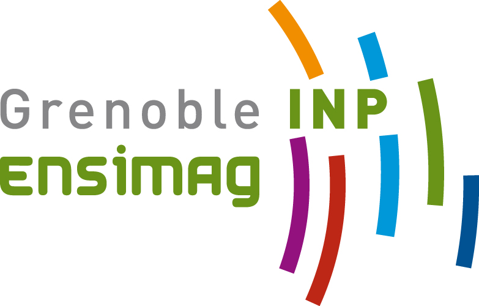

# Projet Génie Logiciel, Ensimag.

gl07, 21/04/2023.

Écriture d'un compilateur pour un langage orienté objet.

## Équipe : Les déca psuleurs
- Charles Breton
- Julian Gomez
- Camille Kasprzak
- Arthur Lenne
- Meriem Lyna Safar Remali
- Gabriel Soria
- Alex Soubeyrand
- Maël Veyrat

## Commandes d'éxécution des tests et compilation

- mvn clean : nettoie l'environnements des indésirables des compilations précédentes

- mvn test-compile : vérifie le code java du compilateur

- test_synt : vérifie la syntaxe du fichier deca passé en paramètre

- test_context : vérifie la syntaxe du fichier deca passé en paramètre

- decac path/fich.decac : test la génération de code à partir du fichier deca passé en paramètre

- ima path/fich.ass : test la compilation du fichier .ass passé en paramètre, généré par la commande précédented decac

## Option de compilation
-v : vérifie le fichier decac, ne produit aucune sortie si aucune erreur

-p : décompile l'arbre abstrait obtenu par l'analyseur syntaxique en code texte 

-d : compilation en mode debug, peut être utilsé sur trois niveaux : -d -d -d

-P : compile plusieurs fichiers decac en parallèle

-r : limite le nombre de registres disponnibles entre 4 et 16

-n : permet de lancer la compilation sans les tests à l'exécution
